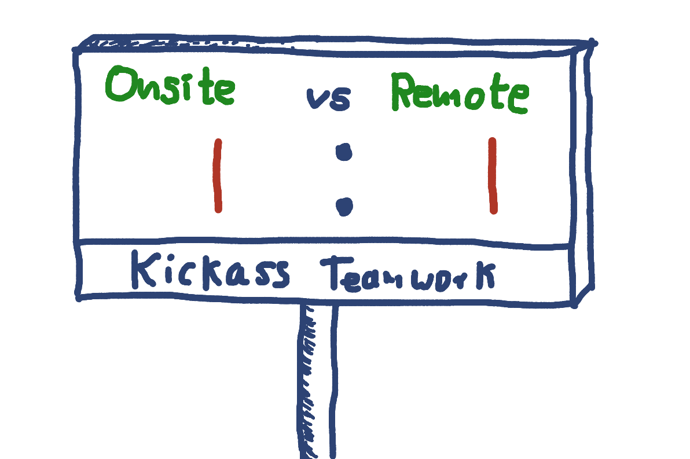

# Leading remote teams
- often and especially in agile projects: Leader not necessarily (project) manager
- content in this chapter derived from my experiences as "technical teamlead"

## Leading by example
.jpg)

- always on time
- always ask if team member has time for a talk instead of just "rushing in"
- "pilot voice",
    - originated by Chuck Yeager, US Air Force pilot, first one to break sound barrier
    - speech pattern emulated by individual pilots without explicit instruction to do so
    - cool, collected, "down-home calmness", relaxed, in-charge, unconcerned

## Trust equation

- credibility = "Can I believe what a person says?"
- reliability = "Do I believe that they deliver?"
- intimacy = "Do I feel safe and secure with a person?"

- increase reliability:
    - Verify Skills: 
        - technical and collaboration skills
        - asking "Are you comfortable doing this task?", "Do you have any concerns about this project?"
    - Be Explicit
        - with expectations and requests
        - about content and timeframe 
    - Lead by Example
    - Count on Others
        - trust in others creates reliability
- increase intimacy:
    - = "likeability"
    - Get Personal
        - learn team members on a personal level: learn about families, vacation plans, hobbies
        - informal discussions and meetings
        - leading by example: let the cat run over your desk during a meeting :)
    - Encourage Social Interactions
        - remote = less "water cooler effect"
        - spend time talking about "stuff" each meeting
        - share small gifts (articles, videos etc.)
    - Over-communicate
    - Meet Face to Face
    - Be Positive

## Delegation

- excursion into Getting things done: "the 3 Ds" = Delete, Delegate, Do (in this order)
- generally important to do delegation right, but especially with remote teams
- in remote teams: Delegation = Investment in more powerful teams = necessary tool to build a remote team
- avoid Micromanagement-Trap (= doing every simple step yourself instead of investing in the team so they can do more and more tasks)

### Example dialog
- communicate reason of delegation: "I have this other important deadline coming up, that's why I cannot do this task by myself"
- communicate reason of why delegation to this person: "You've worked on this module before, so you know it well."
- communicate goal, not task: "The module repeatedly generates bugs. The team says it has become too complicated and needs refactoring."
- clear deadline: "Because our sprint ends in one week, I need the refactoring done in three days."
- communicate resources ("Talk to John, he can help you", "If you have to buy this analysis software, you may spend 100$ for it")
- get commitment, don't command: "That's the task. Do you want to do it?"
- "Do you have any questions about this?"
- always say thank you: "Thanks! You really helped me out here!"
- have task repeated back: "Just to make sure I haven't missed anything, could you please repeat back to me what your task is?"

### Deadlines
- Parkinson's Law: tasks will take as long as there is time
- => always set a deadline
- be reasonable
- set specific deadline: "I need this done by Friday, June 9 at 3pm US Eastern Time", not "in the next few days"
- provides "natural" timeframe after which a request about the progress makes sense => manageability

### The Delegation Checklist
From _Management 3.0_ by Jurgen Appelo.

1. Is the risk factor of delegating this work adequately addressed?
1. Do the people have the right empowerment skills and discipline?
1. Have you considered and selected the right level of authority?
1. Have you considered the question of delegating to individuals or to teams?
1. Is what you are delegating a discrete chunk of work?
1. Do the people have the skills to do this particular kind of work?
1. Do the people have the right format for the work products to use?
1. Do the people have the tools necessary to be successful?
1. To the people know what the results should look like?
1. Did you set the boundary conditions for the work (for example budget, time, resources and quality)?
1. Do the people know when the work is due?
1. Do the people know what progress looks like?
1. Do the people know how often to report to you on progress (adhering to interim milestones)?
1. Is someone available (you or another person) to coach  the people in case they need help? 

- in case delegation went wrong: Ask "What did __I__ do wrong?"
 
## How to assign tasks - avoid "Thy Bystander Effect"
- Kitty Genovese: 1964, New York City, attacked 3 times within 30 minutes - 38 witnesses, not one of them called police
- "The Bystander Effect" - the greater number of bystanders, the less chance of help
- = "everyone's responsibility = noone's responsibility" 
- always give responsibility to specific people
- use direct language: "I need you to work on this task", not "I think we should work on this task"
- assign to individuals, not groups

## "Because"

- "Xerox study": line before a copy machine
    1. "Excuse me, I have five pages. May I use the Xerox machine, because I'm in a rush?" => 94% compliance
    1. "Excuse me, I have five pages. May I use the Xerox machine?" => 60%
    1. "Excuse me, I have five pages. May I use the Xerox machine, because I have to make copies?" => 93%
- third request ridiculous because everyone in line had to make copies
- however successful because of "because"
- => use "because" consistently in communication
- "Please schedule a meeting for next week because we have to discuss our strategy"
- "Please finish this document until tomorrow 10 a.m. because I need to review it"
 
## Regular one-on-ones

- project-entry talk:
    - background?
    - goals?
    - "How can I support you?"
    - state time at which an update-talk will happen
- update talk:
    - development from last meeting
    - new plans for future?
- my experience: offshore developers often more focused on personal gain and development, more open to change if positive for own development => very important to know the real motivation!
- all of those talks with the maximum amount of presence: best would be a physical face-to-case meeting. If remote: video + audio
- attention: make sure one-on-ones happen in separated rooms so the team cannot hear what is talked about (don't let your co-worker sit on his usual desk in the office besides his colleagues)
- great guide: ["Stop wasting my time with your shitty one -on-one meetings" by Mike Acton](https://medium.com/@mike_acton/stop-wasting-my-time-with-your-shitty-one-on-one-meetings-258b5c5c10cc)  

## Connection with actual customer

- setting in my team: extremely "local-thinking" customer, since forever all hired developers co-located, high amount of direct and immediate communication in office
- gain: insight in mood and circumstances
- remote workers: no connection of that sort to customer
- approaches (!) to resolve this situation:
    - let remote team participate in meetings, at least part of the time
    - let remote team members present their stories in sprint review
    - have remote team visit city and facilities of customer at least once at project start, better regularly
    - state names of team members in meetings so the customer knows them as individuals, not just "the indian development team"
    - have remote team members use actual profile pictures in systems like JIRA so that the customer knows them
    - if customer really understands Scrum: offer him to participate in dailies, however just as a guest
