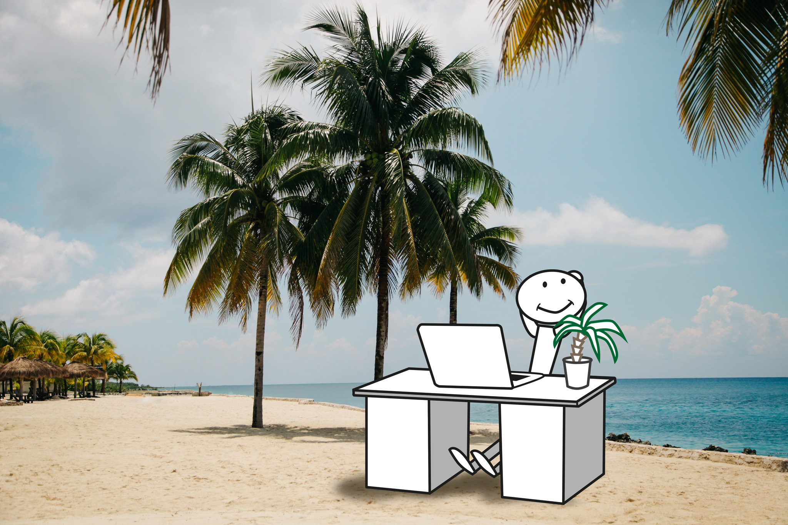

# Remote Working - What it is, what it can be for your team and how to make it so

## Meta: About this workshop
This workshop teaches background knowledge and practical advice on how to work in a remote team. The content is primarily focused on software developers but should also be applicable for other branches.

Working remotely, having digital team members or coding from the Starbucks at the corner: Not having to go to a specific place to participate in an IT project is becoming reality for more and more programmers. However, there are pitfalls and things to consider to make it all work.

## Content
- [introduction and meta](00_introduction_and_meta.md)
- [the concept of remote working:](01_the_concept_of_remote_working.md)
    -  What is it?
    - Why does it have to be learned? 
    - What will happen if we try it?
- [how to make it work](02_how_to_make_it_work.md)
    - What do I have to do to make it work?
    - Why do I have to have a look at my friends and family to make it work?
    - What does my company have to change to be really successful with remote working?
- [moderating remote meetings](03_moderating_remote_meetings.md)
    - What are the phases of every meeting and what does that mean in a remote context?
    - Why is a moderator much more important for remote meetings than for co-located meetings?
    - What do the participants have to know to contribute to a really nice virtual meeting?
- [tools](04_tools.md)
    - Why are tools not the only thing to consider when "going remote"?
    - What are the requirements for tools to be used in a remote context?
    - What tools should I use for which purpose?

Also, there will be some [exercises](05_exercises.md) to perform.

## Organizational
The workshop is considered to be a full-day workshop. However, it heavily relies on the activity and experiences of the participants. It's estimated to have __a length of five to eight hours__.

Further organizational needs see chapters, especially [exercises](05_exercises.md). 

## Meta: Copyright

All files in this repository are under Creative Commons 4.0 (see http://creativecommons.org/licenses/by/4.0/). 
  
You are free to:
  
- Share — copy and redistribute the material in any medium or format
- Adapt — remix, transform, and build upon the material for any purpose, even commercially.
  
The licensor cannot revoke these freedoms as long as you follow the license terms.
  
Under the following terms:
  
- Attribution — You must give appropriate credit, provide a link to the license, and indicate if changes were made. You may do so in any reasonable manner, but not in any way that suggests the licensor endorses you or your use.
- No additional restrictions — You may not apply legal terms or technological measures that legally restrict others from doing anything the license permits.